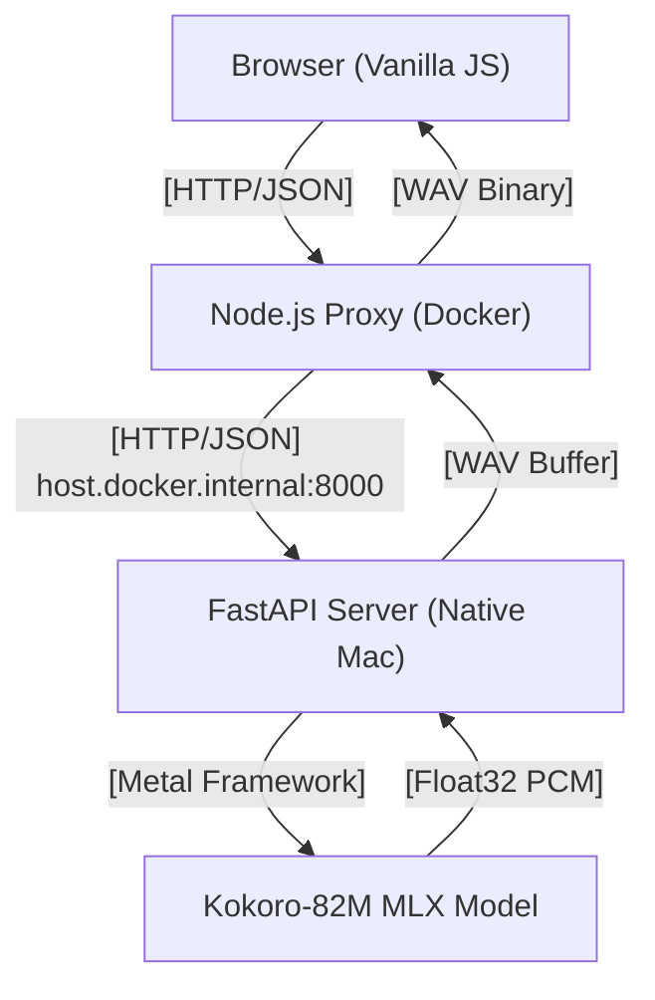

# Technical Specification: Dictée Brevet 2026

This document provides a comprehensive technical overview of the project to enable efficient context loading for LLMs and AI agents in future development sessions.

---

## 🏗️ System Architecture

The application uses a **hybrid architecture** to balance modern web accessibility with high-performance local AI inference on Apple Silicon.

### 1. Unified Communication Flow


### 2. Component Breakdown

#### **A. TTS Engine (Local MLX)**
- **Model**: `mlx-community/Kokoro-82M-bf16`.
- **Reasoning**: Chosen for natural human-like prosody and near-instant inference (82M params) on Apple Silicon.
- **Implementation**: Custom FastAPI server (`tts_server.py`) bypassing the built-in `mlx_audio.server` due to model-type detection bugs for specific variants.
- **Hardware Access**: Must run **natively on host Mac OS** to access the Metal Performance Shaders (MPS) via the MLX framework. Docker cannot access the Apple GPU.

#### **B. Web Backend (Proxy/Caching)**
- **Environment**: Node.js (Alpine) running in **Docker**.
- **Role**: Serves static files, proxies TTS requests, and manages a server-side cache.
- **API Endpoints**:
    - `POST /api/tts`: Primary endpoint. Accepts `{ text }`. Returns `audio/wav`.
    - `POST /api/tts/batch`: For pre-generating multiple segments at once.
    - `GET /api/health`: Monitors connectivity to the local TTS server via `host.docker.internal`.

#### **C. Frontend (Core Logic)**
- **Stack**: Vanilla JS / HTML5 / CSS3 (No frameworks for minimal overhead).
- **State Management**: Centralized `state` object in `app.js`.
- **Audio Strategy**:
    - **Pre-generation**: Phase announcements and phrase-level dictation scripts are fetched after dictée selection.
    - **Phase 2 stability**: Each sentence is synthesized as one TTS request with spoken punctuation markers (for example, `virgule`, `point`) to reduce truncation/repetition risks.
    - **Speed handling**: Model generation stays at `1.0`; playback rate is adjusted client-side.

---

## 📜 Official Dictée Protocol (Brevet 2026)

The logic in `app.js` is strictly aligned with the official French "Diplôme National du Brevet" protocol:

1.  **Phase 1 (Lecture intégrale)**: Full text is read once at natural speed (1.0x). No writing allowed.
2.  **Phase 2 (Dictée effective)**:
    - Text is split into **sentences** (phrase par phrase) using regex: `/(?<=[.!?])\s+/`.
    - Each sentence is read **twice** at a slower speed (default 0.85x).
    - Dictation uses one synthesized phrase per read with punctuation announced inside the phrase.
    - Hardcoded pauses: 2.5 seconds after the first read, 3.5 seconds after the second.
3.  **Phase 3 (Relecture)**: Full text is read one final time at natural speed (1.0x) for final corrections.

---

## 🔌 API & Integration Details

### TTS Server (FastAPI) - Port 8000
- **Path**: `POST /v1/audio/speech` (OpenAI-compatible request body).
- **Format**:
    ```json
    {
      "model": "mlx-community/Kokoro-82M-bf16",
      "input": "Text to synthesize",
      "voice": "ff_siwis",
      "speed": 0.9,
      "lang_code": "f"
    }
    ```
- **Response**: Binary stream of a 16-bit WAV file at 24kHz.

---

## 🚀 Future Development Guidelines

### Adding New Dictées
- Modify `dictees.js`.
- Ensure `texte` contains proper sentence punctuation for the splitter.
- The `groupes` array is currently retained for historical compatibility but is **deprecated** by the official "Sentence Splitter" logic.

### UI Modifications
- Central CSS is in `style.css`.
- The interface uses a **Glassmorphism** aesthetic with a blurred deep blue background.
- Animations are CSS-based (fade-ins, scale on hover).

### Hardware Scaling
- For even higher quality, the model in `tts_server.py` and `server.js` can be swapped for `Qwen3-TTS-12Hz-1.7B-CustomVoice-bf16` (requires `generate_custom_voice()` method update in the Python server).

---

## 📦 File Structure Mapping

- `/app.js`: Main frontend controller and dictation lifecycle logic.
- `/server.js`: Node.js server, caching, and host-bridge networking.
- `/dictees.js`: Data store for dictation texts and grammar rules.
- `/tts_server.py`: Native Python bridge for the MLX model.
- `/tts_server.sh`: Setup and launch script for the local AI environment.
- `/dev_stack.sh`: Start/stop/status orchestrator for TTS + web stack.
- `/docker-compose.yml`: Container orchestration (web app only).
- `/Dockerfile`: Alpine-based Node.js production image.

---

## 🤖 Agent Context & System Invariants

To ensure efficient future interactions with LLMs and Coding Agents, follow these **System Invariants**:

### 1. Protocol Strictness
The application's primary value is its alignment with the **Official Brevet 2026 Protocol**.
- **Rule**: Do not modify the 3-phase structure (Lecture → Dictée → Relecture).
- **Rule**: Phase 2 must always read "phrase par phrase" (sentence by sentence), splitting at `.!?`.
- **Logic Location**: `runDictee()` in `app.js`.

### 2. Hardware Constraint (Metal)
- **Invariant**: The MLX model **must** run on the host Mac OS, not inside Docker.
- **Why**: Docker on macOS cannot access Apple Silicon's Metal GPU (MPS).
- **Communication**: Docker reaches the host via `host.docker.internal:8000`.

### 3. Voice Consistency
- **Preferred Model**: `Kokoro-82M-bf16`.
- **Reason**: Superior speed/quality ratio for French education.
- **Constraint**: If changed, parity must be maintained between `tts_server.py` (Python) and `server.js` (Node.js/Proxy).

### 4. Language Code
- **French Protocol**: Always use `lang_code: "f"` for Kokoro and `language: "French"` for Qwen to ensure proper phoneme generation.

### 5. Deployment Rule
- Run TTS server natively: `./tts_server.sh`.
- Run Web app via Docker: `docker-compose up`.
- Or run both with orchestrator: `./dev_stack.sh start npm|docker`.
